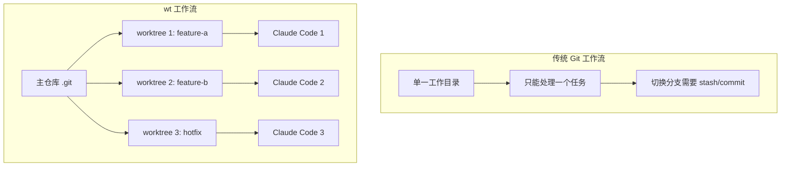
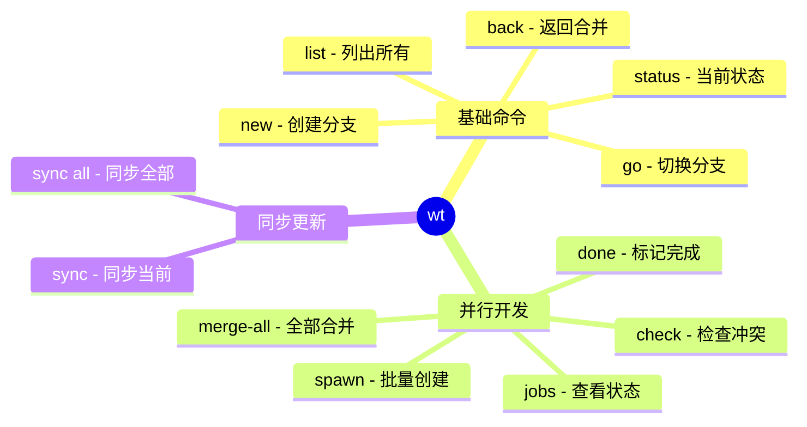
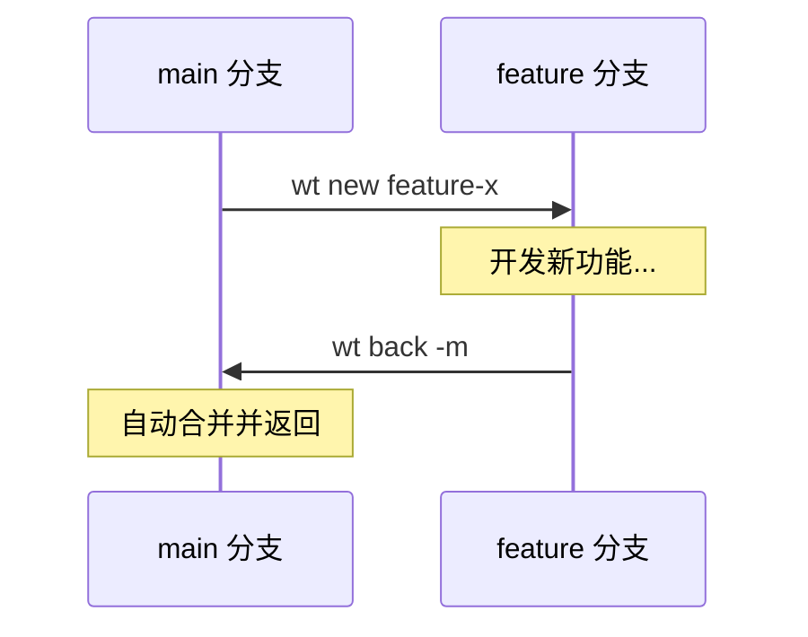
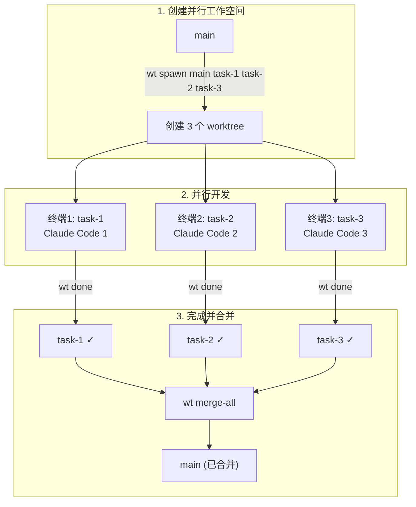
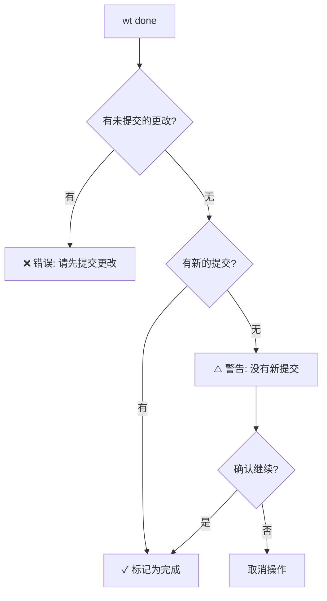
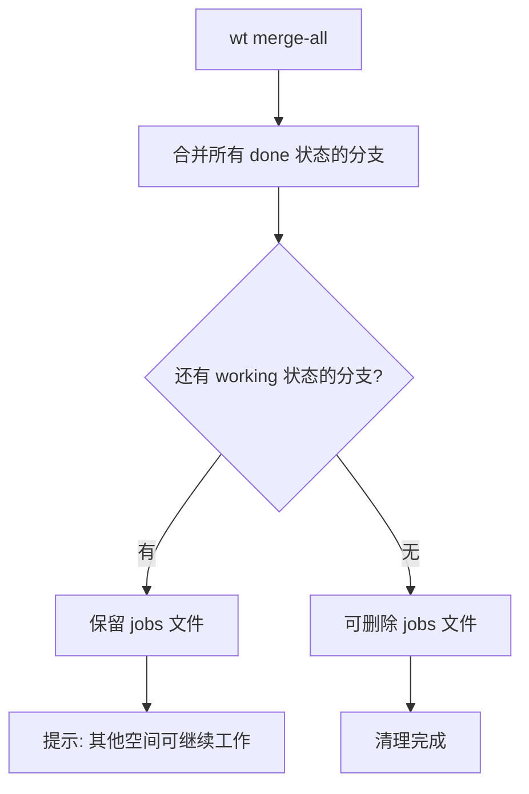
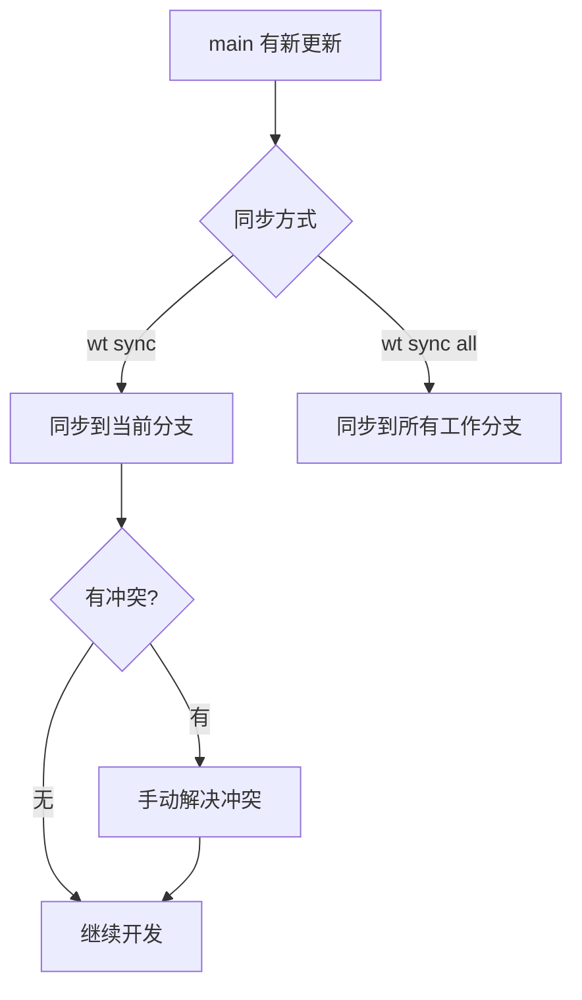
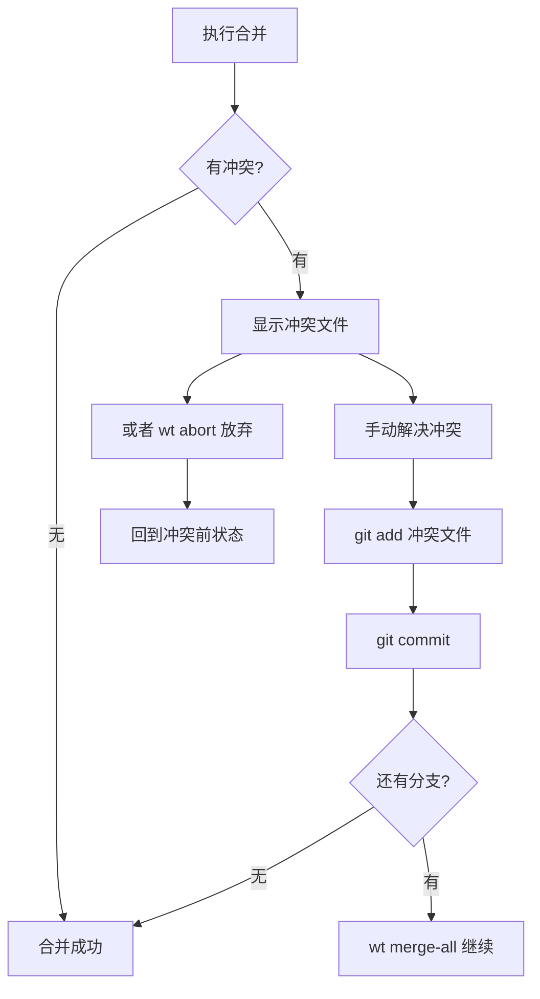

# wt - Git Worktree 工作流管理工具

一个强大的 Git Worktree 管理工具，专为多任务并行开发设计，特别适合与多个 Claude Code 实例协作。

## 核心概念



## 安装

### 快速安装（一键）

```bash
# 创建目录并复制文件
mkdir -p ~/.local/bin && \
cp -r wt wt.sh lib ~/.local/bin/ && \
chmod +x ~/.local/bin/wt ~/.local/bin/lib/*.sh && \
echo 'export WT_SCRIPT="$HOME/.local/bin/wt"' >> ~/.zshrc && \
echo 'source "$HOME/.local/bin/wt.sh"' >> ~/.zshrc && \
source ~/.zshrc
```

### 手动安装

#### 1. 创建安装目录

```bash
mkdir -p ~/.local/bin
```

#### 2. 复制脚本文件

```bash
cp wt ~/.local/bin/
cp wt.sh ~/.local/bin/
cp -r lib ~/.local/bin/
```

#### 3. 添加执行权限

```bash
chmod +x ~/.local/bin/wt ~/.local/bin/lib/*.sh
```

#### 4. 配置 Shell

将以下内容添加到 `~/.zshrc` 或 `~/.bashrc`：

```bash
# Git Worktree 工作流管理
export WT_SCRIPT="$HOME/.local/bin/wt"
source "$HOME/.local/bin/wt.sh"
```

#### 5. 重新加载配置

```bash
source ~/.zshrc  # 或 source ~/.bashrc
```

#### 6. 验证安装

```bash
wt help
```

### 安装后目录结构

```
~/.local/bin/
├── wt                      # 主脚本
├── wt.sh                   # Shell 函数包装器
└── lib/                    # 库文件目录
    ├── colors.sh           # 颜色定义
    ├── helpers.sh          # 辅助函数
    ├── cmd_basic.sh        # 基础命令
    ├── cmd_parallel.sh     # 并行命令
    ├── cmd_sync.sh         # 同步命令
    ├── help.sh             # 帮助文档
    ├── shell_helpers.sh    # Shell 辅助函数
    ├── shell_commands.sh   # Shell 命令实现
    └── completions.sh      # 补全脚本
```

### 卸载

```bash
rm -rf ~/.local/bin/wt ~/.local/bin/wt.sh ~/.local/bin/lib
# 然后从 ~/.zshrc 中删除相关配置
```

## 功能概览



## 使用场景

### 场景一：单人开发工作流



**操作步骤：**

```bash
# 1. 创建新功能分支并进入
wt new feature-login

# 2. 开发完成后，返回 main 并合并
wt back -m

# 3. 或者不合并直接返回
wt back
```

### 场景二：多 Claude Code 并行开发



**操作步骤：**

```bash
# 1. 创建三个并行工作空间
wt spawn main feature-auth feature-ui feature-api

# 2. 在三个终端中分别启动 Claude Code
# 终端 1:
cd /path/to/.worktrees/myrepo/feature-auth && claude

# 终端 2:
cd /path/to/.worktrees/myrepo/feature-ui && claude

# 终端 3:
cd /path/to/.worktrees/myrepo/feature-api && claude

# 3. 各个 Claude Code 完成后，确保已提交代码，然后标记完成
git add . && git commit -m "完成功能"
wt done

# 4. 查看任务状态
wt jobs

# 5. 预检查冲突（可选）
wt check

# 6. 合并所有分支
wt merge-all
```

#### 安全检查机制

**wt done 检查流程：**



**merge-all 清理流程：**



#### 部分分支先完成的情况

支持分批合并，先完成的分支可以先合并，其他分支继续工作：

```bash
# 空间 A 先完成
wt done

# 先合并 A（其他空间仍在工作）
wt merge-all
# 提示：还有分支正在工作中，jobs 文件将保留

# 空间 B 后来完成
wt done

# 继续合并 B
wt merge-all
```

#### 常见问题

**问题：执行 wt done 提示"有未提交的更改"**

需要先提交代码才能标记完成：

```bash
git add .
git commit -m "your changes"
wt done
```

**问题：执行 wt done 提示"没有新的提交"**

分支相对于基础分支没有任何新提交，合并时不会有效果。确认是否已完成开发并提交。


### 场景三：同步主分支更新



**操作步骤：**

```bash
# 同步 main 到当前分支
wt sync

# 同步 main 到所有工作分支
wt sync all
```

## 命令参考

### 基础命令

| 命令 | 简写 | 说明 |
|------|------|------|
| `wt new <branch> [base]` | `wt n` | 创建新 worktree 并切换 |
| `wt back [-m\|--merge]` | `wt b` | 返回上一个工作空间，`-m` 自动合并 |
| `wt go <branch>` | `wt g` | 切换到指定 worktree |
| `wt list` | `wt ls` | 列出所有 worktree |
| `wt status` | `wt st` | 显示当前状态 |
| `wt remove <branch>` | `wt rm` | 删除指定 worktree |
| `wt clean` | `wt c` | 清理无效引用 |

### 并行开发命令

| 命令 | 简写 | 说明 |
|------|------|------|
| `wt spawn <base> <b1> <b2>...` | `wt sp` | 批量创建并行 worktree |
| `wt jobs` | `wt j` | 查看并行任务状态 |
| `wt done [branch]` | `wt d` | 标记分支完成（会检查是否有新提交） |
| `wt check` | `wt ck` | 预检查冲突 |
| `wt merge-all` | `wt ma` | 顺序合并所有已完成分支 |
| `wt abort` | - | 中止合并 |
| `wt jobs-clean` | `wt jc` | 清理所有并行任务 |

### 同步命令

| 命令 | 说明 |
|------|------|
| `wt sync` | 同步主分支到当前分支 |
| `wt sync all` | 同步主分支到所有工作分支 |

## 目录结构

```
your-project/                    # 主仓库
├── .git/
│   ├── wt-stack                 # 工作栈记录
│   └── wt-jobs                  # 并行任务记录
└── src/

../.worktrees/your-project/      # worktree 目录（与主仓库同级）
├── feature-auth/
└── feature-ui/
```

## 冲突处理



## 最佳实践

1. **频繁同步**：定期执行 `wt sync` 减少冲突
2. **小步提交**：在 worktree 中频繁提交，便于追踪
3. **预检查**：合并前用 `wt check` 检查潜在冲突
4. **及时清理**：完成后用 `wt clean` 清理无效 worktree
5. **命名规范**：使用有意义的分支名，如 `feature-*`、`fix-*`

## 故障排除

### 问题：worktree 目录被意外删除

```bash
# 清理无效引用
wt clean
# 或
git worktree prune
```

### 问题：分支已被其他 worktree 使用

```bash
# 查看所有 worktree
wt list

# 删除占用该分支的 worktree
wt remove <branch>
```

### 问题：忘记当前在哪个 worktree

```bash
# 查看当前状态
wt status
```

## License

MIT
